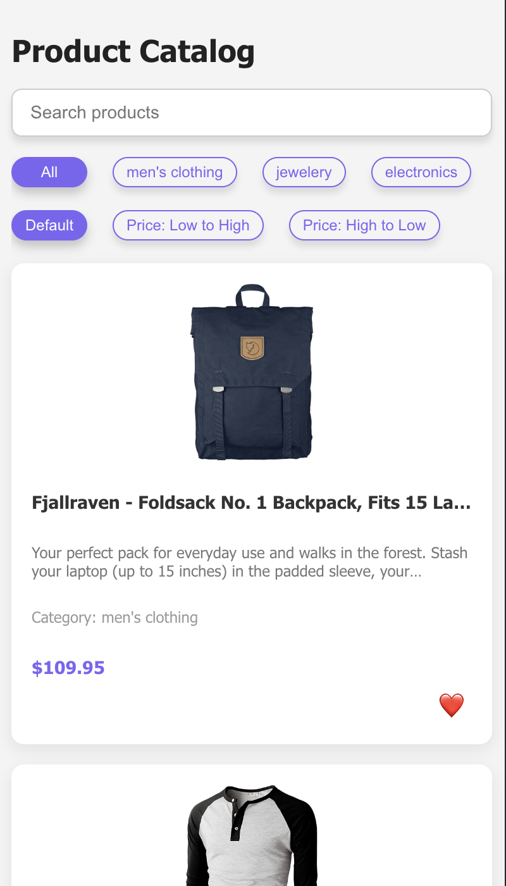
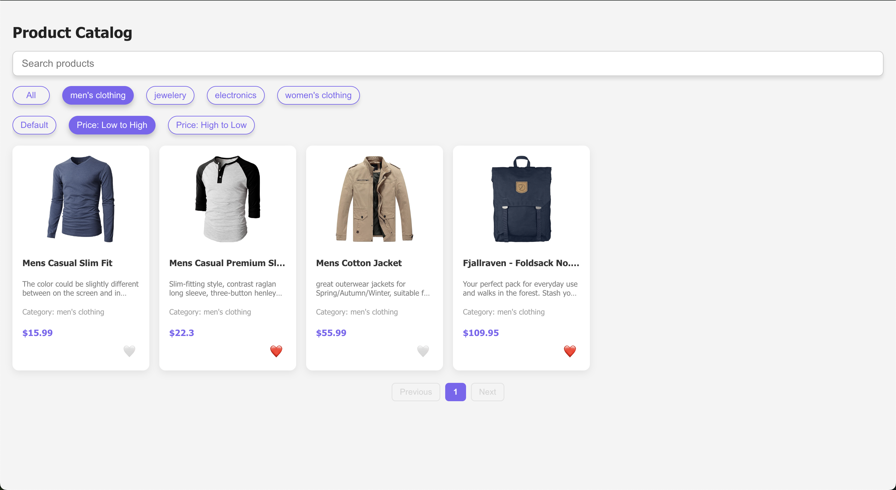
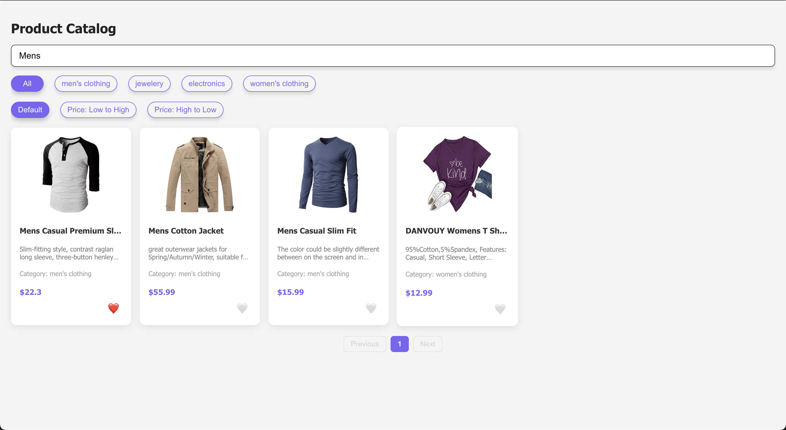

# Product Catalog App

A responsive React application to browse and filter a list of products. It includes features like:

- Product listing from a remote API with pagination 
- Search products
- Filter by category
- Sort by price
- Mark products as favorites 
- View a responsive grid layout that adapts across screen sizes

## Features

- Responsive design using CSS Grid and Flexbox
- Product cards displayed in a square layout
- Smooth hover and favorite interactions
- Persisted favorites using localStorage
- Search + sort + category filter buttons

---

## Tech Stack

- **React**
- **TypeScript**
- **CSS Modules**
- **FakeStore API**
- **Jest**

---

## 🛠️ Setup & Installation

### 1. Clone the repository

git clone https://github.com/noudhar-ouanes/product-catalog-web.git
cd product-catalog-app

### 2. Install dependencies

npm install
####  or
yarn install

### 3. Run the app

npm run start
####  or
yarn start

### 4. Screenshots

#### Dashboard screen 

#### Responsive screen

#### Filter & Sort screen

#### Search screen

### 5. Author

Noudhar Ouanes
LinkedIn : https://www.linkedin.com/in/noudhar-ouanes-464840194/